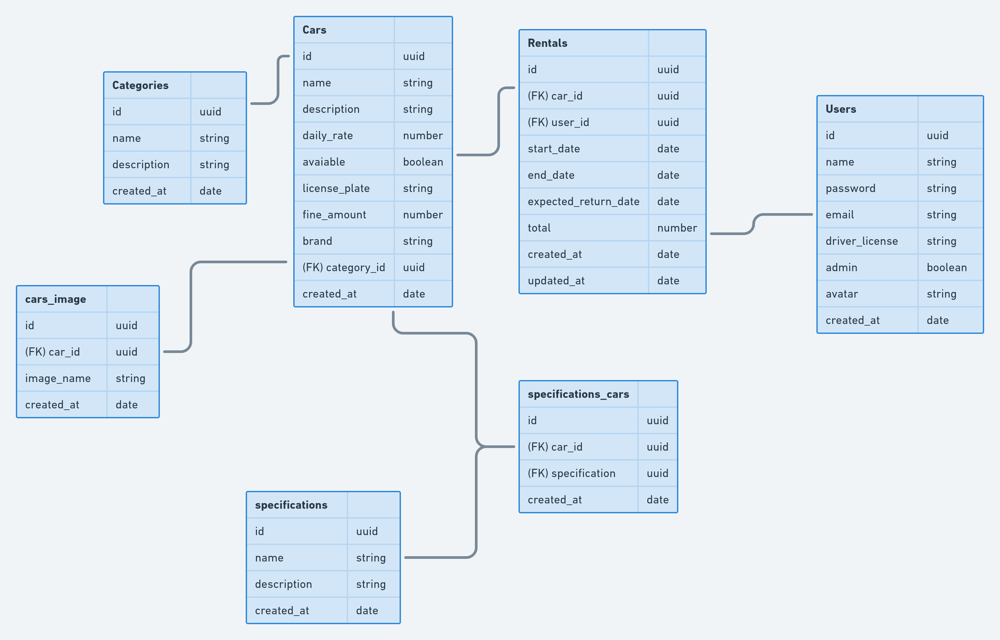
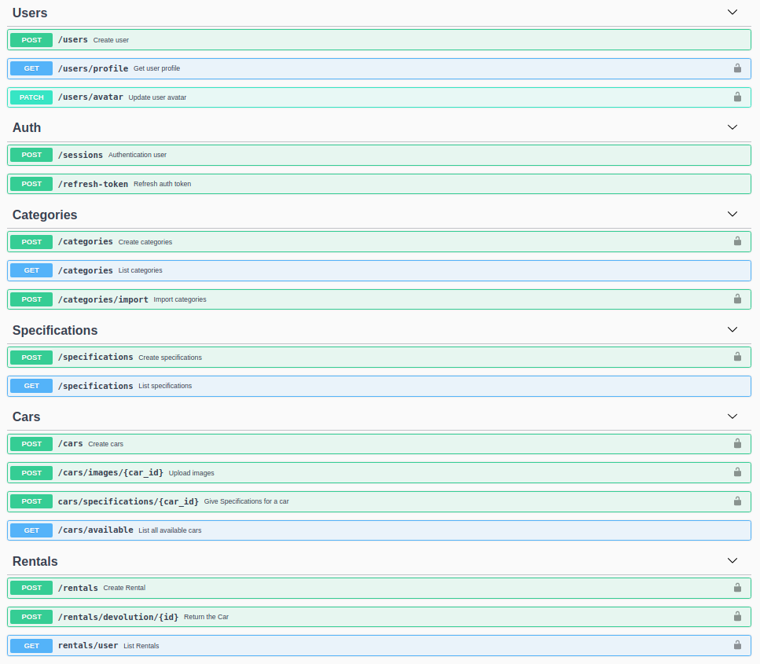

<h1 align="center">RentX</h1>

<h2 align="center">
  Rent-X é uma aplicação para uma locadora de carros, com documentação <code>Swagger</code>, arquitetura <code>S.O.L.I.D</code> e com o deploy automatizado (CI/CD) na AWS
</h2>

<br/>

<h3 align="center">Diagrama da aplicação</h3>

---



---


<h2 >Tecnologias</h2>
<ul>
  <li><a href="https://sentry.io/">Sentry</a> - Monitoramento da instância AWS</li>
  <li><a href="https://github.com/CauaMatheus/Rent-X/blob/main/.github/workflows/main.yml">Github Actions</a> - Deploy automatizado</li>
  <li><a href="https://aws.amazon.com/pt/">AWS</a> - Serviço utilizado para o deploy, envio de e-mail e armazenamento de imagens em produção</li>
  <li><a href="https://www.docker.com/">Docker</a> - Containers isolados</li>
  <li><a href="https://github.com/babel/babel">Babel</a> - Transcompilador</li>
  <li><a href="https://handlebarsjs.com/">Handlebars</a> - Responsável pela view do e-mail</li>
  <li><a href="https://github.com/auth0/node-jsonwebtoken">JWT Auth</a> - Autenticação</li>
  <li><a href="https://github.com/expressjs/multer">Multer</a> - Processamento de arquivos</li>
  <li><a href="https://github.com/nodemailer/nodemailer">Node Mailer</a> - Envio de e-mail</li>
  <li><a href="https://github.com/animir/node-rate-limiter-flexible">Rate Limiter</a> - Rate Limiter que impede ataques DDOS</li>
  <li><a href="https://github.com/scottie1984/swagger-ui-express">Swagger</a> - Documentação interativa com a API</li>
  <li><a href="https://jestjs.io/docs/getting-started">Jest</a> - Testes automatizados</li>
  <li><a href="https://typeorm.io/#/">Typeorm</a> - ORM para que futuras mudanças de banco não afete o código</li>
</ul>

<h2>Documentação Swagger</h2>
<p>
  Está api contém uma documentação interativa com Swagger. Se quiser testar métodos admin, deverá testar em sua máquina.
</p>
<p>
  Aqui vai um exemplo de como está a documentação
</p>





<h2>Como usar ?</h2>

```bash
  #Clone o repositório e entre nele
  git clone https://github.com/CauaMatheus/Rent-X.git
  cd Rent-X
```

```bash
  #Instale as dependências
  yarn
```

<p>Após isso, você deve renomear o arquivo <code>.env.example</code> para <code>.env</code> e configurar com as suas credenciais</p>
<p>Renomeie também o arquivo <code>ormconfig.example.json</code> para <code>ormconfig.json</code> e altere os valores para o desejado. Caso alterar, não esqueça de alterar as mesmas configurações no <code>docker-compose.yml</code></p>

```bash
  #Rode o container
  docker-compose up -d
```

```bash
  #Rode as migrations e após isso, estará apto para testar a aplicação
  yarn typeorm migration:run
  yarn dev
```
